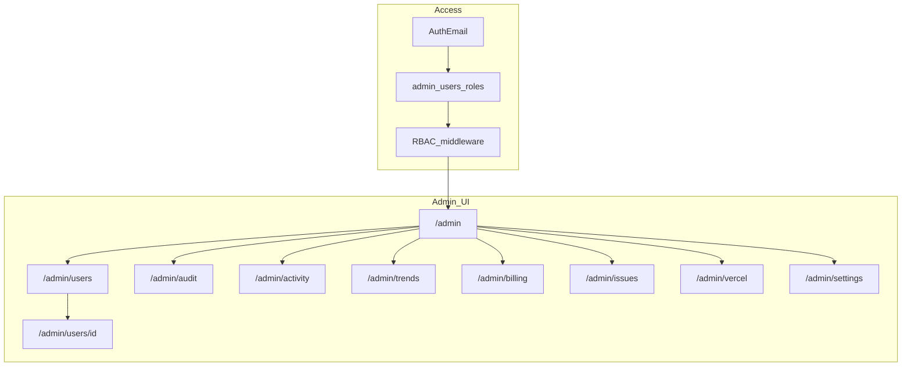

# Admin console — Full vision (one pass)

**Scope choice: C** — build the full ops console in one large delivery (not a thin v1).  
**Prerequisite:** Entitlements soft-launch live (`a704351`). Apply `supabase/migrations/20260816_entitlements.sql` if needed.

## Goals

- Operate NumoraWisdom: users, profiles, audits, activity, trends, billing readiness, Vercel health, issue tracking.
- Start with you (`darshan.kulkarni30@gmail.com`); add more admins via DB (not only hardcoded emails).
- Service-role APIs only; never expose secrets to the client.



## RBAC (built now)

| Role | Can |
|------|-----|
| `superadmin` | Everything + manage admin users |
| `operator` | Users, block, notes, issues, activity, trends, Vercel |
| `support` | Users read, notes, issues; no block; no settings |
| `billing` | Billing panel + entitlements read; users read |

- Seed: your email as `superadmin`.
- Hardcoded `ADMIN_EMAILS` remains a bootstrap fallback if `admin_users` row missing.
- Nav “Admin” visible for any admin role.

## Data model (single migration)

1. **`admin_users`** — `user_id` or `email`, `role`, `active`, `created_at`, `created_by`.
2. **`user_moderation`** — `user_id`, `blocked_at`, `blocked_reason`, `blocked_by`, `updated_at`.
3. **`admin_notes`** — support notes on a user.
4. **`admin_audit_log`** — append-only: actor, action, target_user_id, meta jsonb, created_at (block, unblock, note, plan_override, issue status, admin invite).
5. **`admin_issues`** — tickets: `id`, `user_id` nullable, `title`, `body`, `status` (open/in_progress/resolved/closed), `priority`, `assignee_email`, timestamps.
6. **`app_activity_events`** — light product audit (server-written): `user_id`, `event_type` (login, report_created, profile_saved, business_view, …), `path`, `meta`, `created_at`. Instrument key API routes.
7. Keep reading **`user_entitlements`**, **`people`**, **`reports`**.

## Screens (all in this pass)

| Route | Purpose |
|-------|---------|
| `/admin` | KPI dashboard: users, reports 7/30d, blocked, open issues, enforce flag, last deploy |
| `/admin/users` | Search/filter (email, blocked, plan); paginated |
| `/admin/users/[id]` | Profile people, reports list, entitlements, block/unblock, notes, linked issues, activity feed for that user |
| `/admin/activity` | Live-ish feed of `app_activity_events` (filter by type/user) |
| `/admin/audit` | Admin action audit log (who did what) |
| `/admin/trends` | Charts: signups/reports/people per day; simple retention-ish counts |
| `/admin/billing` | All entitlements summary; plan mix; “Stripe not connected”; stub override plan (superadmin only, audited) |
| `/admin/issues` | Issue queue CRUD + assign + status |
| `/admin/vercel` | Deployments, project info, usage where API allows, deep links; upgrade guidance |
| `/admin/settings` | List/add/deactivate admins + roles (superadmin); show env readiness checklist |

## APIs (`/api/admin/*`)

- Service-role Supabase client + Vercel REST client.
- Every mutating route writes `admin_audit_log`.
- Blocked users: middleware check → `/account-restricted` for app routes.
- Instrument: report create, profile PUT, auth callback (login event), business page hit (optional).

## Vercel panel

- Env: `VERCEL_TOKEN`, `VERCEL_TEAM_ID`, `VERCEL_PROJECT_ID`.
- Show: recent deployments, production URL, build status.
- Usage/limits: fetch what’s available from Vercel API; if Hobby metrics are incomplete, show explicit checklist (bandwidth, serverless invocations, build minutes) with “watch in Vercel dashboard” links and “when to upgrade” thresholds as editorial copy.

## Billing panel

- Read-only aggregates from `user_entitlements`.
- Superadmin: manual plan assign / period end (pre-Stripe), always audited.
- UI placeholder for future Stripe Customer Portal / invoices (no Stripe SDK required yet unless keys exist).

## Explicitly out of this pass (still)

- Full browser clickstream / session replay.
- True user impersonation (“login as user”).
- Live Stripe refunds/invoices (until Stripe is wired).
- PagerDuty / email alerting.

## Env checklist

```
SUPABASE_SERVICE_ROLE_KEY=
VERCEL_TOKEN=
VERCEL_TEAM_ID=
VERCEL_PROJECT_ID=
ENTITLEMENTS_ENFORCE=false
```

## Build sequence (one PR / one deploy)

1. Migration + service-role client + `requireAdmin` / RBAC helpers  
2. `/admin` layout + shell nav + settings (admin users)  
3. Users list/detail + moderation + notes + account-restricted  
4. Activity instrumentation + `/admin/activity` + `/admin/audit`  
5. Trends + billing + issues  
6. Vercel panel  
7. tsc, push, deploy  

## Verify

- Non-admin → no Admin nav; `/admin` 404/403.  
- Superadmin can invite operator; operator cannot change admin_users.  
- Block stops app use; unblock restores.  
- Audit log captures mutations.  
- Activity events appear after report/profile actions.  
- Issues open/close; billing shows entitlements; Vercel degrades gracefully without token.  

## Confirm to build

Reply **“build admin full”** (or “go”) to start implementation. This is a large package (~multi-hour coding pass).
